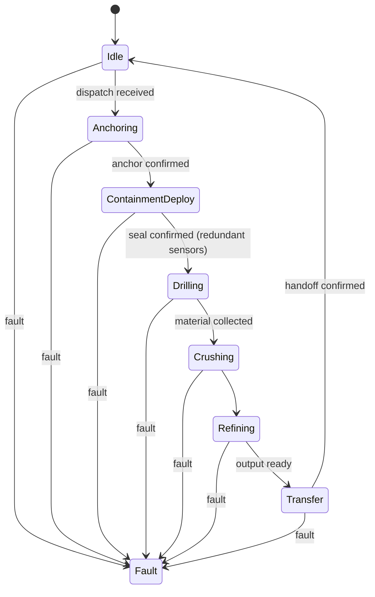

# Miner/Refinery Pod FSM — Draft

Draft state diagram only -- no implementation yet. Follows the same
pattern as [`power-and-propulsion`](https://github.com/Overby-Industries/power-and-propulsion)'s
`ShuttleFSM`: a fault preempts every state, and recovery out of the fault
state is deliberate, not automatic.

## Why ContainmentDeploy gates Drilling

The org's zero-dust mission depends on containment being confirmed *before*
any material is disturbed, not after. A single seal sensor isn't enough to
gate something this consequential -- this needs redundant sensing and
voting logic (multiple independent seal-confirmation signals agreeing)
before transitioning to `Drilling`, the same principle `ShuttleFSM` applies
to `MHD_Activation`'s fault detection.

## Not decided yet

- What "material collected" and "output ready" actually measure (mass
  threshold? volume? time-based?) -- depends on drill/crusher hardware not
  yet chosen.
- Whether `Refining` needs its own sub-FSM per ore type (metal ingot vs.
  aggregate vs. volatile extraction are different processes), similar to
  how `ShuttleFSM` has an `MHDSubState` sub-FSM inside `MHD_Activation`.
