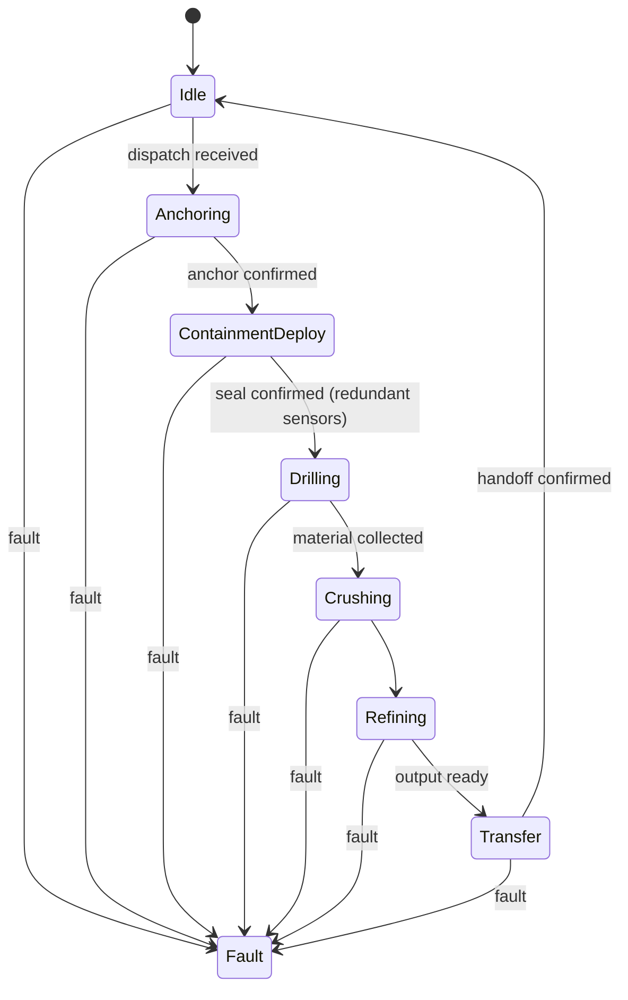

# Miner/Refinery Pod FSM

**Implemented** in [`firmware/lib/miner_pod_fsm`](../firmware/lib/miner_pod_fsm)
(`MinerPodFSM.h`/`.cpp`), builds for both an Arduino Uno and an ESP32 (see
[`docs/hardware-decision.md`](hardware-decision.md)), with logic tests in
[`firmware/test/test_fsm`](../firmware/test/test_fsm). Follows the same
pattern as [`power-and-propulsion`](https://github.com/Overby-Industries/power-and-propulsion)'s
`ShuttleFSM`: a fault preempts every state, and recovery out of the fault
state is deliberate, not automatic.

## Why ContainmentDeploy gates Drilling

The org's zero-dust mission depends on containment being confirmed *before*
any material is disturbed, not after. A single seal sensor isn't enough to
gate something this consequential, so `MinerPodFSM::sealConfirmed()`
requires 2-of-3 independent seal sensors to agree before transitioning to
`Drilling` -- a single failed or miswired sensor can neither block the pod
nor open the gate by itself. Same principle `ShuttleFSM` applies to
`MHD_Activation`'s fault detection, implemented here as explicit sensor
voting rather than a single boolean.

## Not decided yet

- What "material collected" and "output ready" actually measure (mass
  threshold? volume? time-based?) -- depends on drill/crusher hardware not
  yet chosen.
- Whether `Refining` needs its own sub-FSM per ore type (metal ingot vs.
  aggregate vs. volatile extraction are different processes), similar to
  how `ShuttleFSM` has an `MHDSubState` sub-FSM inside `MHD_Activation`.
